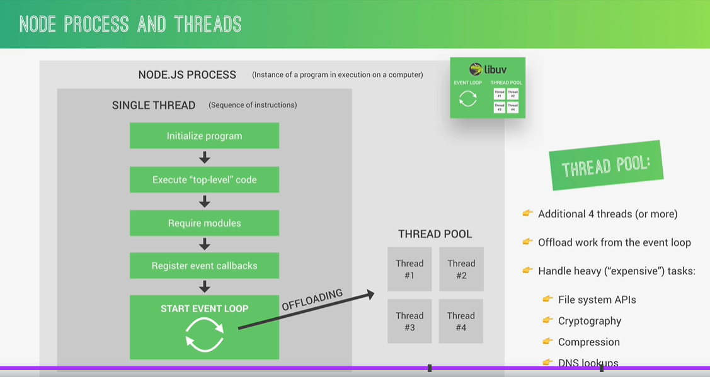
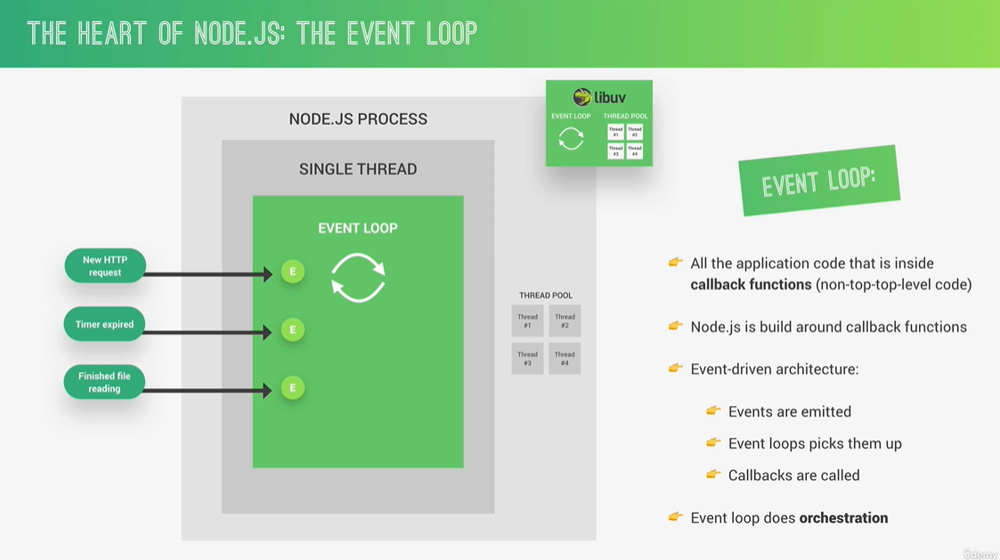
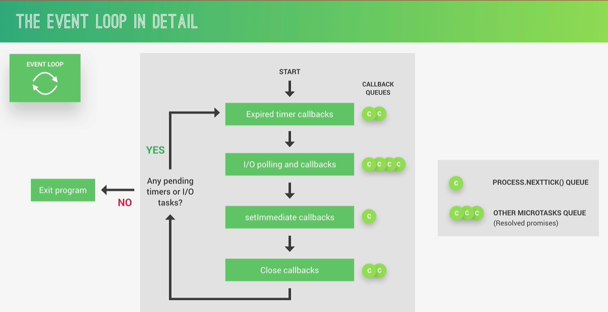
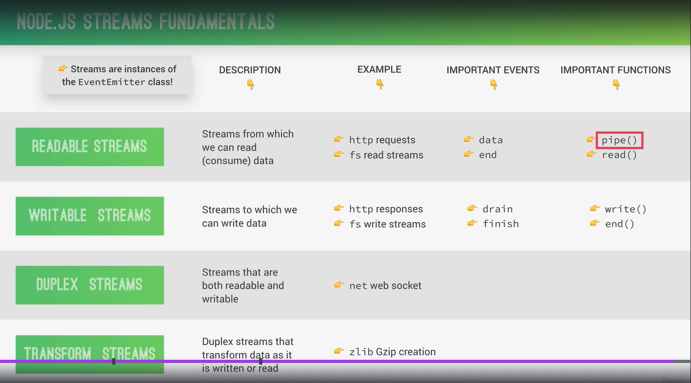
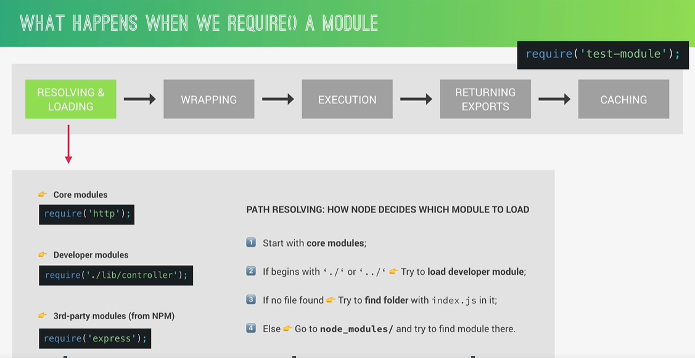
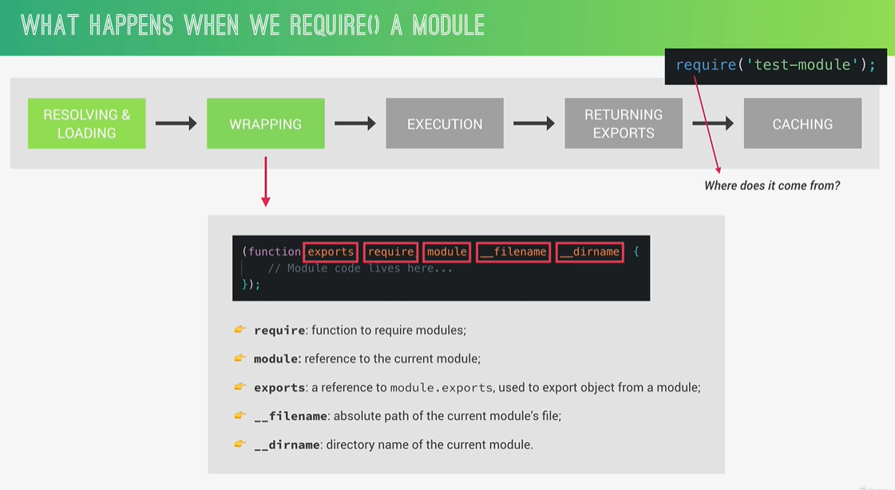
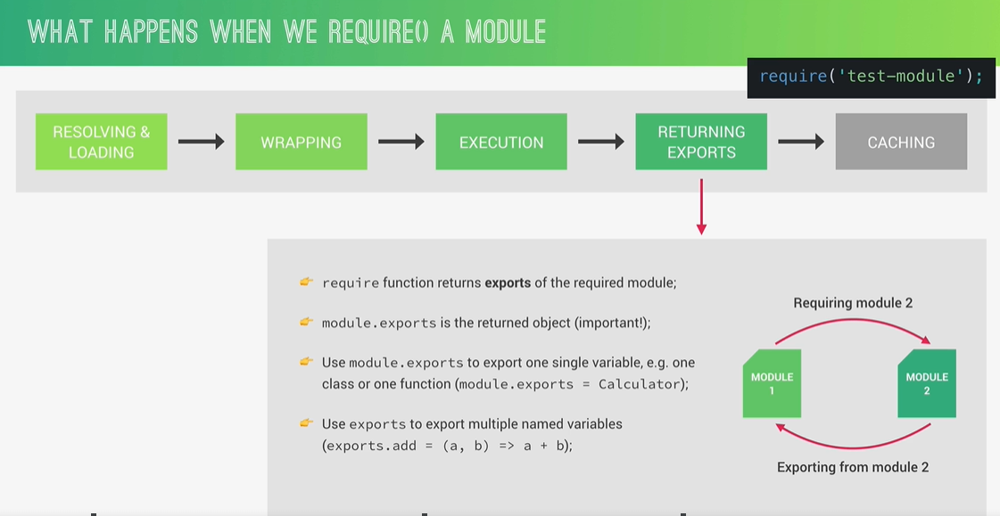

## Google's V8 Engine

Converts JS code into Machine code.

## libuv

It is a open source library which focuses on asynchronous operations like input/output. This layer gives NodeJS access to the computer's operating system, file system, networking and more.
It also implements the Event Loop and Thread Pool.
Event Loop: Is responsible for executing simple tasks like callback functions and network I/O
Tread Pool: Is responsible for performing heavy tasks like accessing files or compressing

libuv - written in C++
V8 Engine - written in JS and C++
NodeJS - written in JS and C++

## Thread Pool

Event loop is Heart of NodeJS, it is responsible for all async tasks. It initializes the program, execute top level code, require modules, register event callbacks.
NodeJS is single threaded, so it uses just a single thread for 10 users or 10 million users. If event loop have any heav tasks like file reading, compressing, cryptography then it blocks the meain thread. So it offloads these heavy tasks to Thread Pool. Thread pool can configure upto 128 threads to complete these tasks.

By default it has 4 threads and we can extend it upto 128 threads. We can manually configure it as below -
process.env.UV_THREADPOOL_SIZE = 2;

## Event Loop

NodeJS is event driven and uses callback functions. For operations like file reading, http requests or timer expired it emits events. Event loop picks them up and call the callback functions related to those events.

Callback Queue:

We should use best practices to avoid blocking in NodeJS:
Don't use sync versions of the functions in fs, crypto and zlib moduels into callback functions
Don't perform complex calculations (nested loops)
Be careful with JSON in larger objects
Don't use too complex regular expressions(e.g. nested quantifier)

## events

const myEmitter = new EventEmitter();
myEmitter.on("onSale", () => {
console.log("There is a sell!");
});
Here .on represents listening to the event

## streams

Perfect for handling large volumns of data like videos.
More efficient data processing in terms of memory (no need to keep all data in memory) and time (we don't have to wait until the all data is available)

## Modules

CommonJS Module System - require, exports or module.exports
ES Module System - used in browsers, imports/exports

When we use require('module_name') then NodeJS first checks for core modules. Then it checks for local modules with the help of path provided. If still it don't find then it checks node module folder. If it is not found in node modules as well it throws aan error and stps the code.

exports, require, module, **filename, **dirname are global variables declared in each module

module.exports to export a single variable e.g. one class or one function
exports to export multiple named variables

Module get called first time then it gets cached and when it next called it will not execute again. It will provide its instance from cached data.
